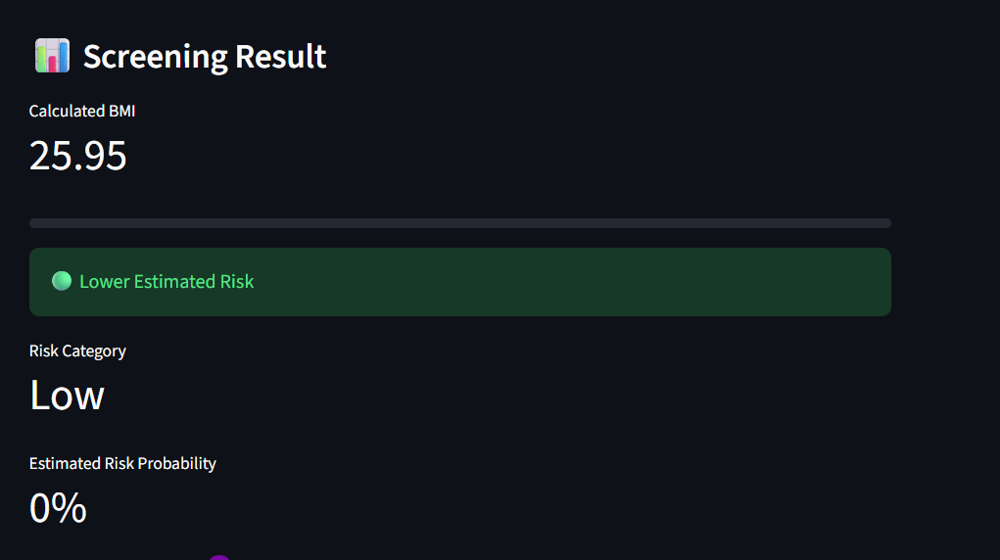

# 🩺 Fatty Liver Risk Screening App

This is a **simple AI-based web app** that helps people understand their **risk of fatty liver disease**.

⚠️ **Important**
- This app is for **learning and awareness only**
- It is **NOT a medical diagnosis**
- Always talk to a doctor for real medical advice

---

## 🌍 Live App (Try It Online)

You can use the app here:

👉 https://fatty-liver-risk-detector-u9abevxlcrz9ojxlpsrsxd.streamlit.app/

---

## 📸 App Screenshots

### 🏠 Main Input Screen
This is where users enter their health details.


---

### 📊 Risk Result Screen
This screen shows:
- BMI
- Risk percentage
- Risk level (Low / Medium / High)



---

### 🧠 Risk Explanation Screen
This chart shows **which factors affected the risk the most**.


---

## 🎯 What This App Does (In Simple Words)

- Takes basic health and lifestyle information
- Uses AI to **estimate fatty liver risk**
- Shows results in an **easy-to-understand way**
- Explains *why* the risk is high or low
- Gives **general health tips**

---

## 👤 Information the App Asks For

### Basic Details
- Age
- Sex
- Height and weight

### Body Fat Information
- BMI (weight based on height)
- Waist size (belly fat)

### Health Conditions
- Diabetes or high blood sugar
- High cholesterol or fat in blood

### Lifestyle Habits
- Alcohol use
- Physical activity level

### Common Early Symptoms  
(these are **not strong symptoms**, just early signs)
- Feeling tired often
- Mild pain on right side of stomach
- Poor focus or “brain fog”

### Simple Liver Marker
- ALT/AST ratio  
  (this is a blood test value that shows liver stress)

---

## 🤖 How the AI Works (Very Simple)

- The app uses a **machine learning model**
- The model learns patterns from **fake (synthetic) data**
- It looks at all inputs together
- Then it gives a **risk score**

⚠️ The data is **not real patient data**

---

## 📊 What Results You Get

- Your BMI
- Risk percentage (0–100%)
- Risk level:
  - 🟢 Low risk
  - 🟡 Medium risk
  - 🔴 High risk
- A chart showing **what increased or reduced the risk**
- Simple health tips

---

## 🛡️ What This App DOES NOT Do

This app does **NOT**:
- Diagnose fatty liver disease
- Replace blood tests or scans
- Give medicine advice
- Predict severe liver disease

---

## 🖥️ Technologies Used

- Python
- Streamlit
- Pandas
- NumPy
- Scikit-learn
- Matplotlib

---

## ▶️ How to Run It on Your Computer

```bash
pip install -r requirements.txt
streamlit run app.py
