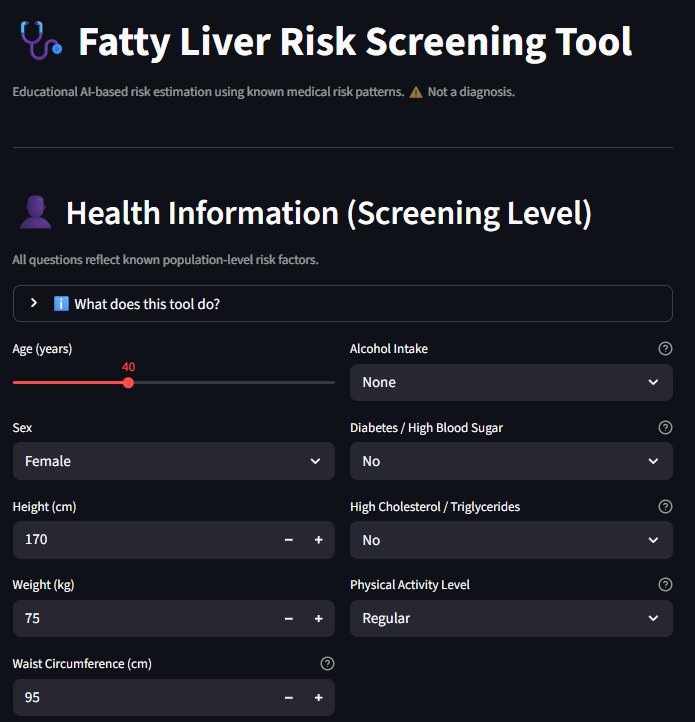
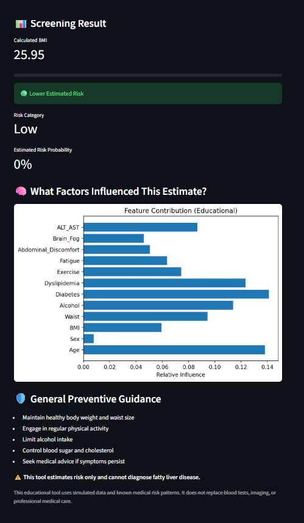

# 🩺 Fatty Liver Risk Screening Tool (Educational)

An **AI-powered Streamlit web application** that estimates **fatty liver disease risk** using
**medically inspired screening factors**, **early symptoms**, and **lifestyle indicators**.

⚠️ **Important Disclaimer**  
This tool is for **education and awareness only**.  
It **does NOT diagnose disease**, does **NOT replace medical tests**, and must **NOT be used for clinical decisions**.

---

## 🌐 Live Demo (Shareable Link)

👉 **Try the app here:**  
🔗 https://fatty-liver-risk-detector-u9abevxlcrz9ojxlpsrsxd.streamlit.app/

> The app is deployed on **Streamlit Community Cloud** and runs fully in the browser.

---

## 📸 Screenshots


Example format:
```markdown




